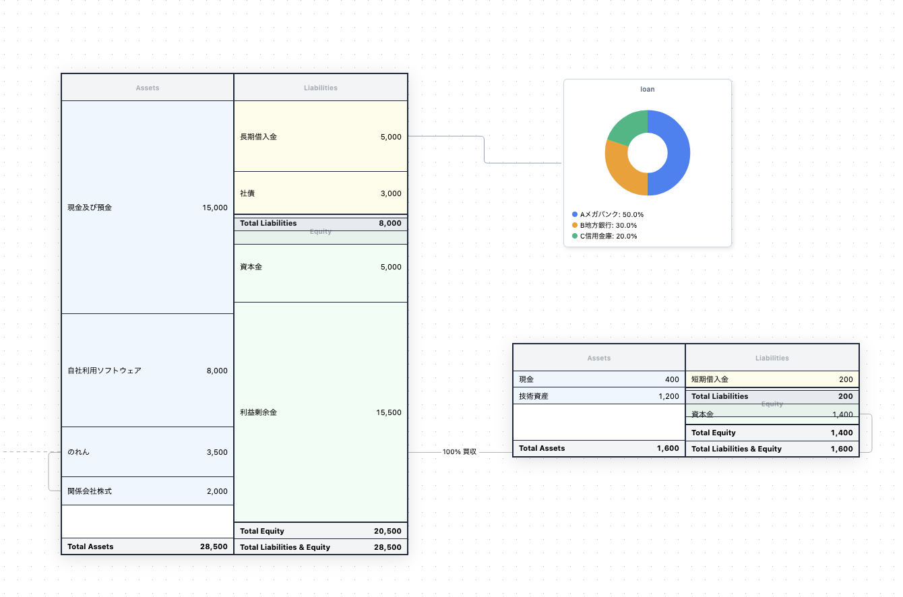

# BSML — Balance Sheet Modeling Language

> Write balance sheets as plain text. Render them as interactive diagrams.

[](https://github.com/goura/bsml/actions/workflows/ci.yml)
[](https://www.npmjs.com/package/@goura/bsml)
[](LICENSE)

---



---

## What is BSML?

Describing corporate structures and M&A deal structures often requires balance sheet diagrams — but building them in Excel, PowerPoint, or diagram tools is slow, hard to version-control, and painful to update.

**BSML** is a plain-text language for balance sheets. You write a simple text file; BSML parses it and renders an interactive, auto-laid-out diagram using React Flow.

```
BalanceSheet "CloudMatrix" {
  config { currency = "JPY" unit = "百万円" }
  Assets {
    cash "現金及び預金" : 15000
    goodwill "のれん"  : 3500
  }
  Liabilities {
    loan "長期借入金"  : 5000
  }
  Equity {
    capital "資本金"          : 5000
    retained_earnings "利益剰余金" : 8000
  }
}

BalanceSheet "DataShield" { ... }

// Draw relationships between entities
CloudMatrix.investments --> DataShield.capital : "100% 買収"
```

↓ Becomes this ↓


---

## Features

- **Plain text** — version-controllable, diffable, easy to edit
- **Multi-entity** — model multiple companies and their relationships on one canvas
- **Auto-layout** — nodes are positioned automatically via Dagre
- **Proportional rows** — asset/liability rows are sized by amount, giving instant visual intuition
- **Annotations** — attach notes and pie-chart callouts to any line item
- **i18n** — built-in locale support (English, Japanese)
- **Interactive canvas** — zoom, pan, drag nodes

---

## Try the Playground

The `demo/` directory contains a live playground built with Vite + Monaco Editor.

```bash
cd demo
npm install
npm run dev
```

Open `http://localhost:5173` — type BSML on the left, see the diagram update live on the right.

---

## Pipeline

```
BSML text  →  parseBSML()  →  AST  →  transform()  →  React Flow nodes/edges  →  <BSMLCanvas />
```

This library exports all three stages so you can use as much or as little as you need.

---

## Project Structure

```
src/
  parser/       Chevrotain-based lexer + parser → AST
  transformer/  AST → React Flow node/edge data
  react/        React components (BalanceSheetNode, BSMLCanvas, ...)
docs/           BSML language specification
demo/           Interactive playground app (Vite)
tests/          Unit + integration tests
```

---

## License

MIT © [Kazuhiro Ogura](https://github.com/goura)
